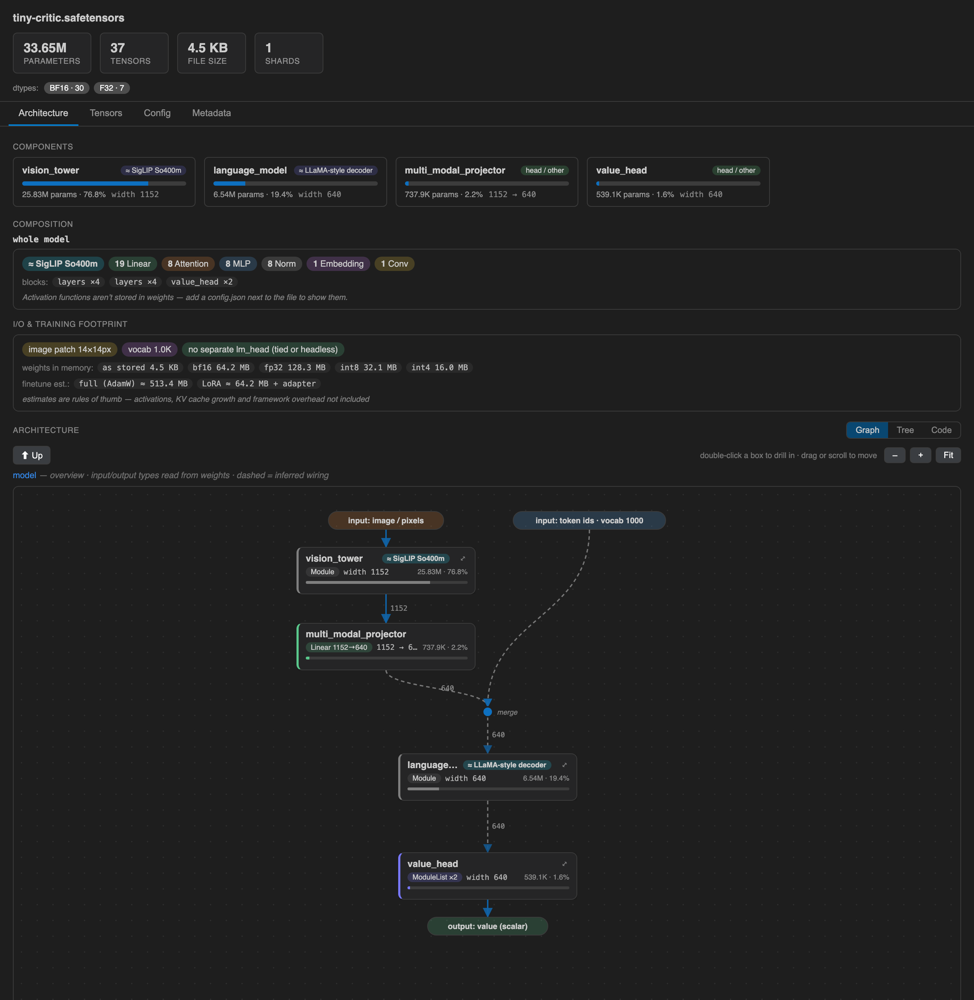

# Weightless

**Inspect models without loading the weights.**

**[Try it in your browser →](https://kkipngenokoech.github.io/weightless/)** — no install; paste a Hub id or drop a local file. Or get the [VS Code extension](https://marketplace.visualstudio.com/items?itemName=kipngenokoech.weightless).



A VSCode extension that opens `.safetensors` and `.gguf` checkpoints — including
multi-GB, multi-shard ones — **instantly**, by reading only the file header. It can even
inspect models **straight from the Hugging Face Hub** without downloading them: a 500 GB
sharded model costs a few hundred KB of traffic.

Double-click any `.safetensors` / `.gguf` file → a rich viewer opens instead of
"binary file not shown."

## Features

### Architecture

- **Flowchart view** — the model as a branch-and-merge diagram: each input branch
  (vision tower, audio encoder, …) in its own column with its **input type**
  (`image / pixels`, `token ids · vocab 262144`) derived from the weights, meeting at a
  **merge junction**, flowing through the trunk, and **splitting out to each head** with
  its output type (`logits · 262144`, `value (scalar)`). Double-click to drill into any
  module; repeated blocks collapse to `×N` (click to expand all N).
- **Tree view** — the classic collapsible module hierarchy.
- **Code view** — the selected scope as a **reconstructed PyTorch-style definition**
  (`Linear(in_features=640, out_features=2048, bias=False)`), GitHub-style with line
  numbers, syntax colors and one-click copy. Gaps in `Sequential` indices are called out
  as parameter-free modules (activations).

### Understanding

- **Backbone identification** — names the architecture family from `config.json`
  (`model_type`, `architectures`, sub-configs), module naming, or **structural
  fingerprints** (`≈ Gemma 3` from its norm scheme + vocab; `≈ SigLIP So400m` from its
  widths) when nothing else is recorded. Plus exact provenance (`base: google/gemma-3-270m`)
  when a sidecar file stored it.
- **Composition** — actual layer counts (Linear / Attention / MLP / Norm / Embedding /
  Conv) per scope, updating as you click around the graph.
- **I/O & training footprint** — image input resolution (from patch + position
  embeddings), context length, vocab, tied/untied lm_head, LoRA rank + targets, weights
  size at bf16/fp32/int8/int4, full-finetune (AdamW) and LoRA memory rules-of-thumb,
  KV-cache per 1k tokens (GQA-aware).

### Inventory

- **Tensor table** — searchable, with a **layer column** (`Linear 640→2048`) so
  `mlp.gate_proj` reads as what it is; shapes, dtypes, params, bytes, shard.
- **Summary** — params, tensor count, file size, shards, dtype distribution.
- **Config / Training / Generation / Adapter / Tokenizer / Metadata tabs** — adjacent
  sidecar JSONs auto-discovered and pretty-printed with syntax highlighting.

### Formats & sources

- **`.safetensors`** — single-file and sharded (`model.safetensors.index.json`).
- **`.gguf`** — llama.cpp / quantized ecosystem: quant dtypes (`Q4_K`, `Q6_K`, …), exact
  per-tensor bytes, metadata mapped onto config facts (layers/heads/GQA/context).
- **Hugging Face Hub** — `Weightless: Open Model from Hugging Face Hub` command; type a
  model id, get the full viewer via HTTP Range requests (header-only). Supports
  `HF_TOKEN` for gated repos.

## How it works (and its one honest limit)

These formats store **weights, not code**: a header describing every tensor's name,
shape, dtype and byte-offsets, followed by raw bytes. Weightless parses only the header
and derives everything that is *actually derivable*: the module hierarchy (dotted names
encode it exactly), repeated structure, layer types and feature dims (from weight
shapes), input modalities (from embeddings), and head output types.

What no tool can get from weights alone is the **true forward-pass graph** (execution
order, activations, skip connections) — that lives in the model's code. Where Weightless
shows inferred wiring, the edges are **dashed** and labeled as such.

## Roadmap

- **Per-tensor stats** — NaN/Inf detection, min/max/mean/std via bounded ranged reads
  (the "is my checkpoint corrupt?" check), still never loading the full file.
- **Checkpoint diff** — compare two files: changed/added/removed tensors, param deltas.
- **Tier 2 — true data-flow graph (opt-in):** a Python companion tracing a forward pass
  with `torch.fx` to render real edges. Requires the model code; strictly optional.

## Install / develop

```bash
git clone <this repo> && cd weightless
npm test          # header parsers (safetensors + GGUF) — no build step, plain JS
# Press F5 in VSCode to launch an Extension Development Host, then open any
# .safetensors / .gguf file, or run "Weightless: Open Model from Hugging Face Hub".
# to package a .vsix:
npx @vscode/vsce package
```

## License

MIT — see [LICENSE](LICENSE).
